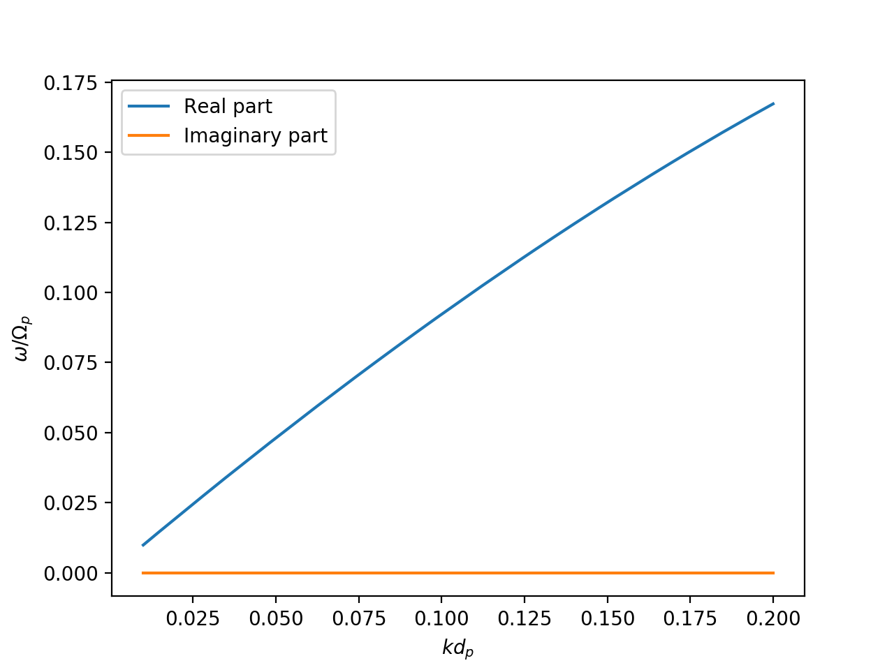

.. include:: ../../README.rst

Example
-------

.. literalinclude:: ../../example.py
   :language: python

.. toctree::
  :maxdepth: 1

  ref

Indices and tables
==================

* :ref:`genindex`
* :ref:`modindex`
* :ref:`search`
